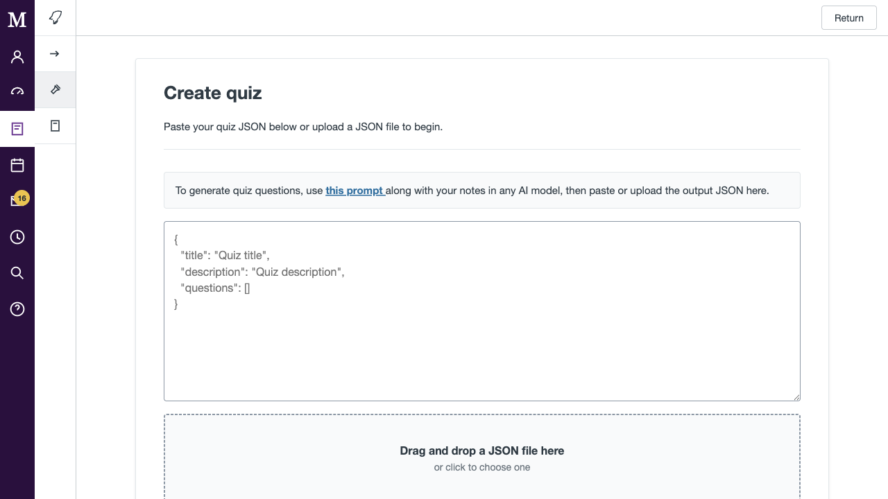
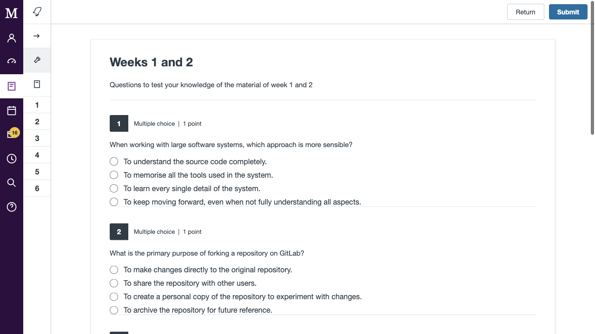
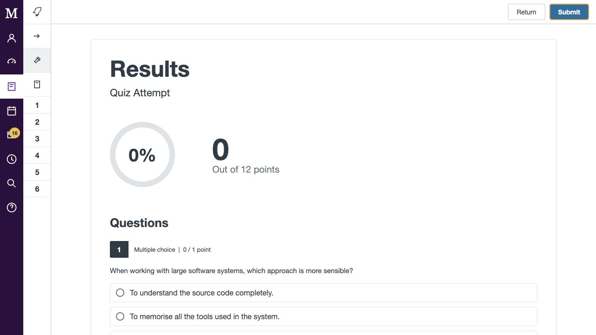

# Canvas Quiz Replicator

A small static web app that recreates a Canvas-style quiz experience. Users can paste quiz JSON, upload a JSON file, take the quiz, and view a marked results page.



## How To Use The Website

1. Open the website in a browser.
2. On the start page, download the prompt by clicking `this prompt`.
3. Use that prompt with your notes in any AI model.
4. Copy the JSON output from the AI model.
5. Paste the JSON into the text box, or upload it as a `.json` file.
6. Click `Begin`.
7. Answer the quiz questions.
8. Click `Submit` to see your score and the correct answers.

## Running Locally

This project does not need a build step or package manager. From the project folder, start a simple local server:

```bash
python3 -m http.server 8000
```

Then visit:

```text
http://localhost:8000
```

You can also open `index.html` directly in a browser, but using a local server is usually smoother for linked files and downloads.

## Creating Quiz Questions

The landing page includes a link to [genericprompt.txt](genericprompt.txt). Download it and use it with your notes in an AI model.

The AI model should return JSON in this shape:

```json
{
  "title": "Quiz title",
  "description": "Short description",
  "questions": []
}
```

Once you have the JSON, paste it into the website or upload it as a `.json` file.

## Taking The Quiz

After you click `Begin`, the app renders the quiz using the JSON you provided.



The left sidebar shows numbered shortcuts for each question. The app supports:

- Multiple choice questions
- Multiple answer questions
- Matching questions
- Fill-in-the-gap questions

## Viewing Results

When you click `Submit`, the app marks the quiz and shows your results.



The results page shows:

- Percentage score
- Points earned
- Each submitted answer
- Correct and incorrect answer highlighting
- Correct answers for missed questions

## JSON Question Types

### Multiple Choice

Use `type: "multi-choice"` when there is one correct answer. The `correct` value is the zero-based index of the correct option.

```json
{
  "type": "multi-choice",
  "text": "Which command is used to stage changes in Git before committing?",
  "options": ["git push", "git add", "git stage", "git save"],
  "correct": 1,
  "points": 1
}
```

### Multiple Answer

Use `type: "multi-answer"` when more than one option is correct. The `correct` value is an array of zero-based option indexes.

```json
{
  "type": "multi-answer",
  "text": "Which commands are useful for inspecting repository state?",
  "options": ["git status", "git commit", "git log", "git diff"],
  "correct": [0, 2, 3],
  "points": 3
}
```

### Matching

Use `type: "matching"` when the user should match prompts to dropdown answers.

```json
{
  "type": "matching",
  "text": "Match each item",
  "matches": [
    {
      "prompt": "Classes",
      "options": ["C++11", "Pre-standard C++", "C++98"],
      "correct": 1
    }
  ],
  "points": 1
}
```

### Fill In The Gaps

Use `type: "fill-gap"` when the question text contains missing keywords. Add placeholders in the text using braces, then provide answers with matching keys.

```json
{
  "type": "fill-gap",
  "text": "The {word_1} class retrieves timeline data.",
  "answers": {
    "word_1": "Timelines"
  },
  "points": 1
}
```

Fill-gap answers are case-insensitive, and extra whitespace is ignored.

## Project Structure

```text
.
├── images/            # README screenshots
├── genericprompt.txt  # Prompt users can download to generate quiz JSON
├── index.html         # Page markup
├── questions.json     # Example quiz JSON
├── script.js          # Landing page, quiz rendering, scoring, and results logic
└── styles.css         # App styles
```

## Notes

The app renders the supplied JSON into the page. Use trusted quiz content, especially if sharing JSON from other people.
